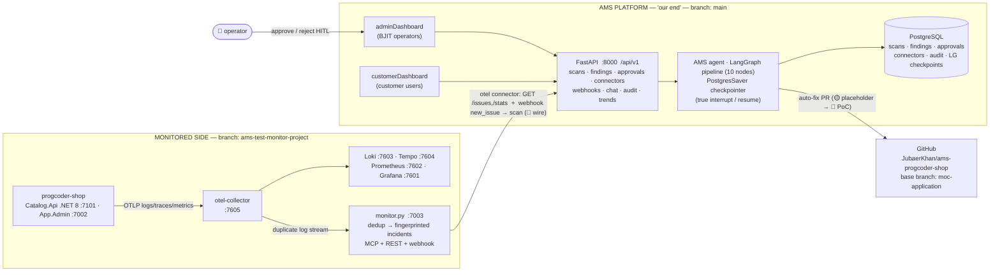
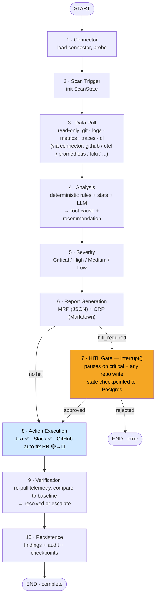
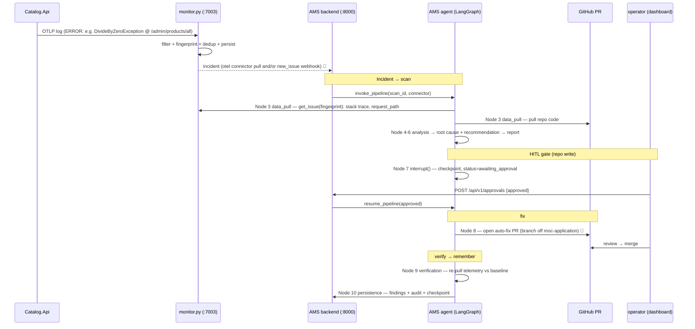

# AMS — PoC v1.0.0 Workflow

> **AMS (AI Agent-Based Application Monitoring System)** watches an application through its existing observability, and when an incident occurs runs the **AMS agent** (a LangGraph pipeline) that **investigates → proposes a fix → opens a human-gated PR → verifies the fix → remembers it**.
>
> This repo holds two halves of that story, on two branches:
>
> | Branch | Contains | Role |
> |---|---|---|
> | **`main`** | `backend/` (FastAPI + LangGraph), `adminDashboard/`, `customerDashboard/`, `landing-page/`, `docs/` | **The AMS platform — "our end". This is where Incident → fix → verify → remember runs.** |
> | **`ams-test-monitor-project`** | `monitor/` (standalone OTEL monitor), `progcoder-shop/` (monitored demo app) | **The monitored side** — the demo target and the process that turns its telemetry into incidents. |
>
> **PoC target app:** `progcoder-shop` (.NET 8 + React, 2 seeded defects). **End goal:** point the same platform at *any* app / *any* repo.

Status: ✅ implemented · 🟡 partial / placeholder · 🔨 PoC focus (to implement) · ⚙️ config · 🔭 future

---

## 1. Two sides, one loop



The monitored side **produces** incidents; the AMS platform **consumes** them and runs the loop. The monitor already does log collection + dedup, so the platform reuses it rather than re-ingesting raw logs.

---

## 2. AMS platform (`main`) — internal architecture

FastAPI backend, thin routes → services → LangGraph pipeline, SQLAlchemy/Postgres, two React dashboards.

```
backend/app/
├── main.py                 # FastAPI factory; builds + compiles the graph at startup (lifespan)
├── config.py               # env settings
├── database.py             # engine / session / Base
├── api/routes/             # scans, findings, approvals, connectors, webhooks, chat, audit, trends, users, agent, admin, auth, health, overview
├── services/               # scan_service, approval_service, connector_service, finding_service, agent_service, audit_service, chat_service, ...
├── models/                 # scan, finding, approval, connector, audit_log, user   (+ LangGraph checkpoint tables)
├── schemas/                # Pydantic request/response
└── agents/
    ├── graph.py            # StateGraph: 10 nodes, conditional HITL edges, PostgresSaver, invoke_pipeline() / resume_pipeline()
    ├── state.py            # ScanState
    └── nodes/              # connector, scan_trigger, data_pull, analysis, severity_classification,
                            # report_generation, hitl_gate, action_execution, verification, persistence
```

### The AMS agent = the loop

This pipeline **is the AMS agent** — the autonomous actor that runs Incident → fix → verify → remember.



| Loop stage (your framing) | AMS pipeline nodes | Status |
|---|---|---|
| **Incident** (collect) | 1 Connector · 2 Scan Trigger · 3 Data Pull (pull incident from monitor + code from repo) | ✅ pipeline · 🔨 monitor-as-source wiring |
| **fix** (investigate → propose → act) | 4 Analysis · 5 Severity · 6 Report · **8 Action Execution → auto-fix PR** | ✅ analysis/report · 🟡→🔨 code-fix PR |
| *(gate)* | 7 HITL Gate `interrupt()` | ✅ |
| **verify** | 9 Verification (deferred telemetry re-pull vs baseline) | ✅ node · depth TBD |
| **remember** | 10 Persistence (findings history, audit trail, LG checkpoints) + verification's baseline compare | ✅ |

**What the PoC actually adds** to this existing loop:
1. 🔨 **Incident source** — feed monitor incidents into the platform: an `otel` connector reading the monitor's `GET /issues`,`/stats`, and/or the monitor's `new_issue` **webhook triggering a scan** (push).
2. 🔨 **The AMS agent's code-fix PR** — implement Node 8's GitHub auto-fix (today a placeholder): the AMS agent reads the affected repo, generates a real patch, and opens a PR against `moc-application`.

---

## 3. End-to-end: one incident, start to finish



---

## 4. Key contracts

### Monitor → AMS (incident source)
- **Webhook** (push) fired on every `new_issue` / `repeat_occurrence`:
  `{ event, severity, service_name, fingerprint, exception_type, message, count, occurrence:{trace_id, span_id, request_path} }`
- **MCP / REST** (pull): `get_issue(fingerprint)` → full record incl. `sample_stack_trace`; plus `list_issues`, `get_stats`, `list_recent_occurrences` (REST mirrors at `/issues`, `/stats`, `/occurrences`).
- `fingerprint = sha256(service_name | severity | (exception_type or scope_name) | normalized_message)[:16]` — stable dedup key, and the natural **incident-memory key**.

### AMS platform (FastAPI, `:8000`, bearer = `API_TOKEN`)
- Pipeline entry: `invoke_pipeline(db, scan_id, trigger, connector_id)` · resume: `resume_pipeline(scan_id, approved, notes)`.
- Connectors (`models/connector.py`, read-only): `github · gitlab · bitbucket · datadog · prometheus · loki · sentry · otel · github_actions · sonarqube · jira · slack`.
- Ingress: `POST /api/v1/webhooks/github` (push/PR/workflow_run → scan) ✅; **monitor/otel trigger** 🔨.
- HITL: `POST /api/v1/approvals` resumes the checkpointed graph.

### Git / PR target (PoC)
`github.com/JubaerKhan/ams-progcoder-shop` · base branch **`moc-application`** · fixes land in the **Catalog Application-layer handlers**.

---

## 5. Seeded incidents (built-in test cases)

| Incident | Route | Exception | Source (Catalog.Application) | State |
|---|---|---|---|---|
| Unpublished product detail | `GET /admin/products/{id}` | `NullReferenceException` | `Features/Product/Queries/GetProductByIdQuery.cs` | **fixed** (incident 126, PR #3) |
| Zero sale-price list | `GET /admin/products/all` | `DivideByZeroException` (fails whole list) | `Features/Product/Queries/GetAllProductsQuery.cs` | **fixed** (incident 188) |

Canonical list: `progcoder-shop/APPLICATION-OVERVIEW.md`. These give a deterministic error → fix → PR demo.

---

## 6. Component status

| Layer | Component | Status |
|---|---|---|
| **AMS platform (`main`)** | FastAPI backend + `/api/v1` routes | ✅ |
| | LangGraph 10-node pipeline + PostgresSaver checkpointer | ✅ |
| | HITL gate (`interrupt()` / `resume_pipeline`) | ✅ |
| | Action Execution — Jira, Slack | ✅ |
| | Action Execution — **GitHub auto-fix PR** | 🟡 placeholder → 🔨 |
| | Verification node (deferred telemetry re-pull) | ✅ (depth TBD) |
| | Persistence / audit / findings history (remember) | ✅ |
| | Connectors (github, otel, jira, slack, prometheus, loki, …) | ✅ |
| | adminDashboard / customerDashboard | ✅ |
| **Monitored side (`ams-test-monitor-project`)** | progcoder-shop app + observability stack | ✅ / ⚙️ |
| | monitor.py (dedup, MCP, REST, webhook) | ✅ |
| | **Monitor → AMS wiring** (otel connector + push trigger) | 🔨 |

---

## 7. Final outcome — future considerations (beyond the PoC)

`progcoder-shop` is the **ideal case**: we have its source (a GitHub repo) *and* OpenTelemetry is already wired in. The product must still work when one or both are missing. These are **future** cases we're designing toward — **not** in the current PoC.

### 7.1 Degraded inputs — coverage matrix

The mock gives us two things for free that a real client may not: shared code, and preinstalled observability. The AMS agent has to cover every quadrant.

| | **OTEL / observability present** | **Nothing preinstalled (client / branch side)** |
|---|---|---|
| **Code shared (repo access)** | ✅ **PoC happy path** — read code → patch → **fix PR** | Adapt to whatever they run (Datadog / ELK / CloudWatch / Sentry / Prometheus via read-only MCP connectors), **or** offer an optional lightweight OTEL collector; then read code → fix PR |
| **Code NOT shared** | Diagnose from telemetry + error signature → **root-cause + suggested fix** (advisory, not a direct PR); optionally request scoped read-only access | Hardest case — work from the **issue description + error signature + patterns** alone → advisory diagnosis + recommended change the client's own devs apply |

**Design implications to carry forward:**
- **Repo access is a capability, not an assumption.** Put code access behind an interface with modes — *full* (clone → branch → PR), *scoped read-only* (fetch only the files a stack trace points at), *none* (telemetry + patterns only). The AMS agent **degrades gracefully** across these instead of failing.
- **Observability is pluggable.** The monitor/OTEL path is one connector among many; the connector library already covers Datadog / Prometheus / Loki / Sentry. When nothing is installed, either adapt to the client's existing stack or deploy an **optional** lightweight OTEL collector — never a hard requirement (keeps the *"no agents inside customer servers / Pull & Analyze"* principle intact).
- **Output adapts to access.** With code → a real PR. Without code → a structured remediation report (root cause, the exact change to make, affected symbols) a human applies. **Same investigation, different last mile.**

### 7.2 A "hermes-like" autonomous coding capability for the AMS agent

Node 8's code-fix is a placeholder today. The final AMS agent needs a real autonomous **coder** — the capability class of **hermes** (the `beacon-agent` coding CLI already in the org at `BJIT-AMS-Agent-Platform/Custom_Agent/rnd_custom_agent/beacon-agent`). Bring these features into the AMS agent — port from hermes source, and/or invoke hermes as a subprocess the way `knowledge_agent`'s `call_hermes` already does:

| Capability | In hermes source | Gives the AMS agent |
|---|---|---|
| Precise file edit / patch | `tools/patch_parser.py`, `tools/file_tools.py`, `tools/file_operations.py` | apply an exact diff, not blind regeneration |
| Sandboxed build + test | `tools/code_execution_tool.py`, `tools/terminal_tool.py` | **verify the fix before proposing it** |
| Git + GitHub PR workflow | `skills/github/` — `github-pr-workflow`, `github-repo-management`, `github-auth`, `codebase-inspection` | branch → commit → PR, end to end |
| Iterative loop with gates | `tools/approval.py`, `tools/interrupt.py` | read → attempt → test → refine, wired into the existing HITL gate |

> There is even a `skills/bjit-ams` skill already in that tree — a natural starting point.
>
> **Reuse path:** shortest first — invoke `hermes` as a subprocess from Node 8 (retargeted from SSH-exec to repo → edit → test → PR). Longer term — lift the tools/skills above into the AMS agent so the coding capability is **native and portable** across any repo.

This upgrades the AMS agent from *detect + report* to *detect → **write and test a fix** → PR* — the actual final outcome.

---

## 8. Repo / branch layout

```
p1888_ai_trans_agentic_ams  (Gerrit + GitHub remotes)
├─ main  ──────────────── AMS PLATFORM ("our end")
│   ├─ backend/          # FastAPI + LangGraph pipeline (the loop) + connectors
│   ├─ adminDashboard/   # operator UI (scans, findings, approvals, connectors)
│   ├─ customerDashboard/# customer UI (incidents, chat)
│   ├─ landing-page/  ·  documentation/  ·  docs/
│
└─ ams-test-monitor-project ── MONITORED SIDE (demo)
    ├─ monitor/          # monitor.py (:7003) + alert-receiver.py  — incident source
    └─ progcoder-shop/   # .NET 8 + React target app w/ seeded defects + OTEL stack

Github/progcoder-shop/   # identical app source, GitHub remote — the PR target for fixes
```

> `FLOW.md` (shared separately) is the design write-up of this same platform; this file reflects the **code as it exists on `main`** today, plus the two 🔨 PoC gaps.
